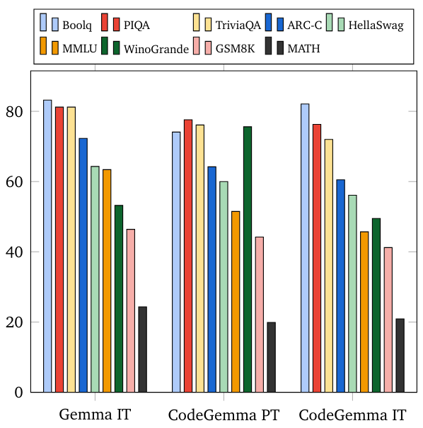

# CodeGemma

Model Page
: [CodeGemma](https://ai.google.dev/gemma/docs/codegemma)

Resources and Technical Documentation
: [Technical Report](https://goo.gle/codegemma)
: [Responsible Generative AI Toolkit](https://ai.google.dev/responsible)

Terms of Use
: [Terms](https://www.kaggle.com/models/google/codegemma/license/consent/verify/huggingface?returnModelRepoId=google/codegemma-7b-it)

Authors
: Google

## Model Information

Summary description and brief definition of inputs and outputs.

### Description

CodeGemma is a collection of lightweight open code models built on top of Gemma. CodeGemma models are text-to-text and text-to-code decoder-only models and are available as a 7 billion pretrained variant that specializes in code completion and code generation tasks, a 7 billion parameter instruction-tuned variant for code chat and instruction following and a 2 billion parameter pretrained variant for fast code completion.

|                                  | [codegemma-2b](https://huggingface.co/google/codegemma-2b) | [codegemma-7b](https://huggingface.co/google/codegemma-7b) | [**codegemma-7b-it**](https://huggingface.co/google/codegemma-7b-it) |
|----------------------------------|:----------------------------------------------------------------:|:----------------------------------------------------------:|:----------------------------------------------------------------:|
| Code Completion                  |                                 ✅                                |                              ✅                             |                                                                  |
| Generation from natural language |                                                                  |                              ✅                             |                                 ✅                                |
| Chat                             |                                                                  |                                                            |                                 ✅                                |
| Instruction Following            |                                                                  |                                                            |                                 ✅                                |

### Sample Usage

This model is intended to answer questions about code fragments, to generate code from natural language, or to engage in a conversation with the user about programming or technical problems. If you need to use code completion (for example, integrated in an IDE), we recommend you use one of the pre-trained models instead: [CodeGemma 7B](https://huggingface.co/google/codegemma-7b), or [CodeGemma 2B](https://huggingface.co/google/codegemma-2b).

#### For Code Generation

```python
from transformers import GemmaTokenizer, AutoModelForCausalLM

tokenizer = GemmaTokenizer.from_pretrained("google/codegemma-7b-it")
model = AutoModelForCausalLM.from_pretrained("google/codegemma-7b-it")

input_text = "Write me a Python function to calculate the nth fibonacci number."
input_ids = tokenizer(input_text, return_tensors="pt")

outputs = model.generate(**input_ids)
print(tokenizer.decode(outputs[0]))
```

#### Chat Template

The instruction-tuned models use a chat template that must be adhered to for conversational use.
The easiest way to apply it is using the tokenizer's built-in chat template, as shown in the following snippet.

Let's load the model and apply the chat template to a conversation. In this example, we'll start with a single user interaction:

```py
from transformers import AutoTokenizer, AutoModelForCausalLM
import transformers
import torch

model_id = "google/codegemma-7b-it"
dtype = torch.bfloat16

tokenizer = AutoTokenizer.from_pretrained(model_id)
model = AutoModelForCausalLM.from_pretrained(
    model_id,
    device_map="cuda",
    torch_dtype=dtype,
)

chat = [
    { "role": "user", "content": "Write a hello world program" },
]

prompt = tokenizer.apply_chat_template(chat, tokenize=False, add_generation_prompt=True)
```

At this point, the prompt contains the following text:

```
<bos><start_of_turn>user
Write a hello world program<end_of_turn>
<start_of_turn>model
```

As you can see, each turn is preceded by a `<start_of_turn>` delimiter and then the role of the entity
(either `user`, for content supplied by the user, or `model` for LLM responses). Turns finish with
the `<end_of_turn>` token.

You can follow this format to build the prompt manually, if you need to do it without the tokenizer's
chat template.

After the prompt is ready, generation can be performed like this:

```py
inputs = tokenizer.encode(prompt, add_special_tokens=False, return_tensors="pt")
outputs = model.generate(input_ids=inputs.to(model.device), max_new_tokens=150)
```

### Inputs and Outputs

Inputs
: For pretrained model variants: code prefix and/or suffix for code completion and generation scenarios, or natural language text or prompt
: For instruction tuned model variant: natural language text or prompt

Outputs
: For pretrained model variants: fill-in-the-middle code completion, code and natural language
: For instruction tuned model variant: code and natural language

## Model Data

Data used for model training and how the data was processed.

### Training Dataset

Using Gemma as the base model, CodeGemma 2B and 7B pretrained variants are further trained on an additional 500 billion tokens of primarily English language data from publicly available code repositories, open source mathematics datasets and synthetically generated code.

### Training Data Processing

The following data pre-processing techniques were applied:

  * FIM Pretrained CodeGemma models focus on fill-in-the-middle (FIM) tasks. The models are trained to work with both PSM and SPM modes. Our FIM settings are 80% FIM rate with 50-50 PSM/SPM.
  * Dependency Graph-based Packing and Unit Test-based Lexical Packing techniques: To improve model alignment with real-world applications, we structured training examples at the project/repository level to co-locate the most relevant source files within each repository. Specifically, we employed two heuristic techniques: dependency graph-based packing and unit test-based lexical packing
  * We developed a novel technique for splitting the documents into prefix, middle, and suffix to make the suffix start in a more syntactically natural point rather than purely random distribution.
  * Safety: Similarly to Gemma, we deployed rigorous safety filtering including filtering personal data, CSAM filtering and other filtering based on content quality and safety in line with [our policies](https://storage.googleapis.com/gweb-uniblog-publish-prod/documents/2023_Google_AI_Principles_Progress_Update.pdf#page=11).

## Implementation Information

Information about the hardware and software used to train the models.

### Hardware

CodeGemma was trained using the latest generation of [Tensor Processing Unit (TPU)](https://cloud.google.com/tpu/docs/intro-to-tpu) hardware (TPUv5e).

### Software

Training was done using [JAX](https://github.com/google/jax) and [ML Pathways](https://blog.google/technology/ai/introducing-pathways-next-generation-ai-architecture/).

## Evaluation Information

Model evaluation metrics and results.

### Evaluation Approach

We evaluate CodeGemma on a variety of academic benchmarks across several domains:

  * Code completion benchmarks: HumanEval Single Line and Multiple Line Infilling
  * Code generation benchmarks: HumanEval, MBPP, BabelCode (C++, C#, Go, Java, JavaScript, Kotlin, Python, Rust)
  * Q&A: BoolQ, PIQA, TriviaQA
  * Natural Language: ARC-Challenge, HellaSwag, MMLU, WinoGrande
  * Math Reasoning: GSM8K, MATH

### Evaluation Results

#### Coding Benchmarks

Benchmark             | 2B    | 7B    | 7B-IT
----------------------|-------|-------|------
HumanEval             | 31.1  | 44.5  | 56.1
MBPP                  | 43.6  | 56.2  | 54.2
HumanEval Single Line | 78.41 | 76.09 | 68.25
HumanEval Multi Line  | 51.44 | 58.44 | 20.05
BC HE C++             | 24.2  | 32.9  | 42.2
BC HE C#              | 10.6  | 22.4  | 26.7
BC HE Go              | 20.5  | 21.7  | 28.6
BC HE Java            | 29.2  | 41.0  | 48.4
BC HE JavaScript      | 21.7  | 39.8  | 46.0
BC HE Kotlin          | 28.0  | 39.8  | 51.6
BC HE Python          | 21.7  | 42.2  | 48.4
BC HE Rust            | 26.7  | 34.1  | 36.0
BC MBPP C++           | 47.1  | 53.8  | 56.7
BC MBPP C#            | 28.7  | 32.5  | 41.2
BC MBPP Go            | 45.6  | 43.3  | 46.2
BC MBPP Java          | 41.8  | 50.3  | 57.3
BC MBPP JavaScript    | 45.3  | 58.2  | 61.4
BC MBPP Kotlin        | 46.8  | 54.7  | 59.9
BC MBPP Python        | 38.6  | 59.1  | 62.0
BC MBPP Rust          | 45.3  | 52.9  | 53.5

#### Natural Language Benchmarks



## Ethics and Safety

Ethics and safety evaluation approach and results.

### Evaluation Approach

Our evaluation methods include structured evaluations and internal red-teaming testing of relevant content policies. Red-teaming was conducted by a number of different teams, each with different goals and human evaluation metrics. These models were evaluated against a number of different categories relevant to ethics and safety, including:

  * Human evaluation on prompts covering content safety and representational harms. See the [Gemma model card](https://ai.google.dev/gemma/docs/model_card#evaluation_approach) for more details on evaluation approach.
  * Specific testing of cyber-offence capabilities, focusing on testing autonomous hacking capabilities and ensuring potential harms are limited.

### Evaluation Results

The results of ethics and safety evaluations are within acceptable thresholds for meeting [internal policies](https://storage.googleapis.com/gweb-uniblog-publish-prod/documents/2023_Google_AI_Principles_Progress_Update.pdf#page=11) for categories such as child safety, content safety, representational harms, memorization, large-scale harms. See the [Gemma model card](https://ai.google.dev/gemma/docs/model_card#evaluation_results) for more details.

## Model Usage & Limitations

These models have certain limitations that users should be aware of.

### Intended Usage

Code Gemma models have a wide range of applications, which vary between IT and PT models. The following list of potential uses is not comprehensive. The purpose of this list is to provide contextual information about the possible use-cases that the model creators considered as part of model training and development.

Code Completion
: PT models can be used to complete code with an IDE extension

Code Generation
: IT model can be used to generate code with or without an IDE extension

Code Conversation
: IT model can power conversation interfaces which discuss code.

Code Education
: IT model supports interactive code learning experiences, aids in syntax correction or provides coding practice.

### Known Limitations

Large Language Models (LLMs) have limitations based on their training data and the inherent limitations of the technology.  See the [Gemma model card](https://ai.google.dev/gemma/docs/model_card#evaluation_results) for more details on the limitations of LLMs.

### Ethical Considerations & Risks

The development of large language models (LLMs) raises several ethical concerns. We have carefully considered multiple aspects in the development of these models.  Please refer to [the same discussion](https://ai.google.dev/gemma/docs/model_card#ethical_considerations_and_risks) in the Gemma model card for model details.

### Benefits

At the time of release, this family of models provides high-performance open code-focused large language model implementations designed from the ground up for Responsible AI development compared to similarly sized models.

Using the coding benchmark evaluation metrics described in this document, these models have shown to provide superior performance to other, comparably-sized open model alternatives.